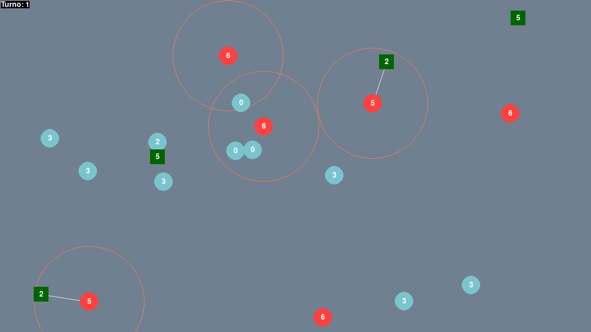

# Ultimo sangue

Il gioco si svolge in un'arena grande quanto lo schermo da cui non si può uscire. Ogni personaggio parte con un certo numero di punti vita. Ad ogni turno di gioco i personaggi possono attaccare oppure spostarsi nell'arena. Quando un personaggio subisce un attacco che porta i suoi punti vita a zero, questo viene rimosso dal gioco. La partita procede turno dopo turno, finché non resta un solo personaggio in gioco.

L'arena è grande **1280x720 unità**. All'inizio del gioco viene inizializzata con 20 personaggi posizionati in modo casuale.

**Attenzione: è richiesto il pacchetto [Pygame](https://www.pygame.org/) per eseguire il programma**.

## Classi

I personaggi sono visualizzati sullo schermo come forme geometriche colorate, che contengono il numero dei punti vita residui. Ci sono tre diverse tipologie di personaggi:

- `Personaggio semplice`: nel suo turno può solo spostarsi e non possiede alcun tipo di attacco. Parte con 3 punti vita. Il personaggio semplice è rappresentato da un *cerchio pieno azzurro*.
- `Arciere`: ad ogni turno attacca con una freccia il personaggio più vicino (1 danno) entro il massimo della sua visuale (**160 unità**). Se non può attaccare nessuno, si sposta. Parte con 5 punti vita. L'arciere è un *rettangolo pieno verde*. Qualora attacchi, la traiettoria della sua freccia è rappresentata da una *linea bianca*.
- `Bombarolo`: ad ogni turno di gioco attacca con un'esplosione (3 danni) tutti i personaggi in una certa area (distanza massima **120 unità**). Se non può attaccare nessuno, si sposta. Parte con 6 punti vita. Il bombarolo è un *cerchio pieno rosso*. Qualora attacchi, la sua area offensiva è rappresentata da un *cerchio vuoto arancione*.

## Spostamenti

All'interno del proprio turno, un personaggio può spostarsi di **15 unità**. Per tutti i personaggi, la direzione dello spostamento (qualora si debbano muovere) è la stessa nel proprio turno, ed è inizializzata a caso. Ci sono due casi in cui la direzione di movimento può cambiare:

1. il personaggio tocca il bordo dell'arena
2. il risultato del lancio di un dado a 12 facce è 1 (~8.3% dei casi)

Se una di queste eventualità si verifica, la direzione di spostamento cambia casualmente di un angolo compreso tra -45° e +45°.

## Bonus

- Aggiungere una classe di personaggi `Cecchino`, che nel suo turno seleziona uno a caso dei nemici nella sua visuale (distanza massima **200 unità**) e gli infligge un danno di 100 punti vita. Se non può attaccare nessuno, si sposta come gli altri. Il cecchino ha 1 solo punto vita. Inoltre, dopo che ha sparato, il cecchino è impegnato nella ricarica e non può compiere alcuna azione per altri 3 turni. Il cecchino è un *triangolo pieno grigio* e la traiettoria del suo colpo è una *linea bianca*.

- Aggiungere una classe di personaggi `ArciereMagico` che si comporta esattamente come l'arciere ma che, ogni volta che viene colpito, scompare dalla posizione attuale e ricompare in un punto casuale dell'arena di gioco. L'arciere magico è un *rettangolo pieno verde chiaro*.
